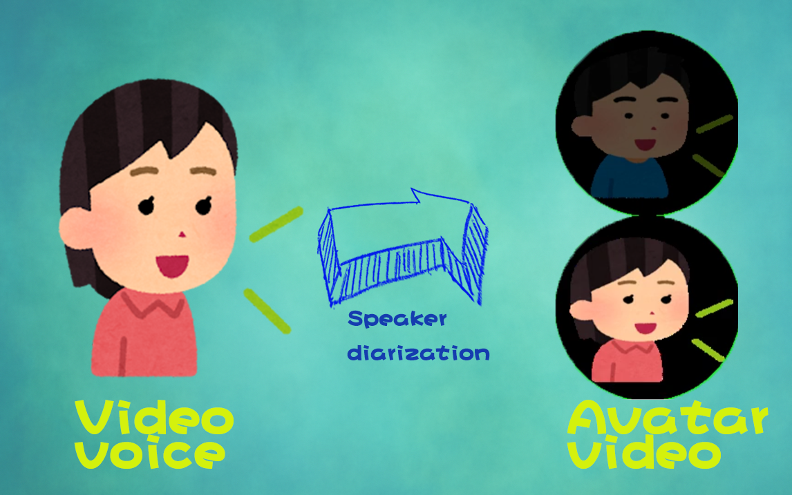

# 🎙️ 说话人分离转头像视频生成 (Speaker Diarization to Avatar Video)

---

## 🔄 工作流程 flow


---
## 📺 示例与演示
- **B站视频演示**：[BV1a3gWzbEq6](https://www.bilibili.com/video/BV1a3gWzbEq6)
- **在线体验地址**：[website](http://010233.xyz)  
  > ⚠️ **注意：该网站非常弱，只能处理 10 秒左右的音频**。

<details>
<summary>中文 README</summary>

这是一个基于 **[pyannote.audio](https://github.com/pyannote/pyannote-audio)** 的 Web 演示工具，支持 **音频/视频的说话人分离**，并生成带有说话人头像可视化的视频。

---

## ✨ 功能特点

- **上传音频/视频**  
  支持 video/* 和 audio/wav 格式。
  
- **说话人分离**  
  自动识别音频中的说话人，或手动指定人数。

- **头像可视化**  
  - 为每个说话人上传头像。  
  - 当某个说话人发言时，视频左上角显示对应头像。  
  - 多人同时发言时，头像会自动上下排列。

- **生成多种视频版本**  
  - **动态高度版**  
  - **固定列版**  
  - **横向排列版**  
  - 视频背景默认透明。

---


## 🚀 使用说明

### 1. 上传视频/音频
- 选择一个视频或音频文件上传。
- 可选填 **“说话人数”**，若留空则自动检测。

### 2. 上传头像并生成视频
- 系统会列出检测到的 **说话人 ID**。
- 依次上传对应的头像文件。
- 点击 **提交头像并生成视频**。

### 3. 预览生成的视频
- 页面下方会展示不同版本的视频预览（动态高度版、固定列版、横向排列版）。

---

## ⚙️ 本地运行

### 1. 克隆仓库
```bash
git clone https://github.com/yourname/speaker-diarization-demo.git
cd speaker-diarization-demo
````

### 2. 安装依赖

```bash
python -m venv spk  # 最好python3.8下运行, py -3.8 -m venv spk 
spk\Scripts\activate
pip install -r requirement_win.txt
```

### 3. 获取模型访问权限

1. 接受 [pyannote/speaker-diarization-3.1](https://huggingface.co/pyannote/speaker-diarization-3.1) 模型的用户条款。
2. 在 [https://huggingface.co/settings/tokens](https://huggingface.co/settings/tokens) 创建 Access Token，并在代码中使用：

```python
pipeline = Pipeline.from_pretrained("pyannote/speaker-diarization-3.1",
                                use_auth_token="Your Access Token")
```

### 4. 启动服务

```bash
python app.py
```

打开浏览器访问： [http://127.0.0.1:5000](http://127.0.0.1:5000)

> **Windows 用户**：可直接双击 0run.bat 启动。

---

## 📌 TODO

* [ ] 支持手动编辑说话时间段。
* [ ] 支持手动调整模型判断的说话人身份。

---

## 📜 许可证

本项目使用 **MIT License** 开源。

</details>

<details>
<summary>English README</summary>

This is a **web demo based on [pyannote.audio](https://github.com/pyannote/pyannote-audio)** that supports **speaker diarization for audio/video** and generates videos with speaker avatar visualization.

---

## ✨ Features

* **Upload Audio/Video**
  Supports video/\* and audio/wav formats.

* **Speaker Diarization**
  Automatically detects speakers in the audio or allows manual specification of the number of speakers.

* **Avatar Visualization**

  * Upload an avatar for each speaker.
  * When a speaker talks, their avatar is displayed at the top-left corner of the video.
  * If multiple speakers talk simultaneously, their avatars are stacked vertically.

* **Multiple Video Versions**

  * **Dynamic Height Version**
  * **Fixed Column Version**
  * **Horizontal Version**
  * Video background is transparent by default.

---

## 📺 Demo

* **Ytb Video**: [demo video](https://www.youtube.com/watch?v=jXeE4_lJL5M)
* **Online Demo**: [website](http://010233.xyz)

  > ⚠️ **Note: The website is limited and can only process \~10 seconds of audio.**

---


## 🚀 How to Use

### 1. Upload Audio/Video

* Choose an audio or video file to upload.
* Optionally fill in **“Number of Speakers”**, leave it empty for automatic detection.

### 2. Upload Avatars and Generate Video

* The system will list all detected **speaker IDs**.
* Upload avatar images for each speaker.
* Click **Submit Avatars & Generate Video**.

### 3. Preview the Generated Videos

* Different versions (dynamic height, fixed column, horizontal) will be displayed on the page.

---

## ⚙️ Local Setup

### 1. Clone the Repository

```bash
git clone https://github.com/yourname/speaker-diarization-demo.git
cd speaker-diarization-demo
```

### 2. Install Dependencies

```bash
python -m venv spk  # It's recommended to use Python 3.8. py -3.8 -m venv spk 
spk\Scripts\activate
pip install -r requirement_win.txt
```

### 3. Get Model Access Token

1. Accept the user conditions for [pyannote/speaker-diarization-3.1](https://huggingface.co/pyannote/speaker-diarization-3.1).
2. Create an access token at [https://huggingface.co/settings/tokens](https://huggingface.co/settings/tokens) and use it in the code:

```python
pipeline = Pipeline.from_pretrained("pyannote/speaker-diarization-3.1",
                                use_auth_token="Your Access Token")
```

### 4. Start the Service

```bash
python app.py
```

Open [http://127.0.0.1:5000](http://127.0.0.1:5000) in your browser.

> **Windows Users**: Simply double-click 0run.bat.

---

## 📌 TODO

* [ ] Allow manual editing of speaker time segments.
* [ ] Allow manual adjustment of detected speaker identities.

---

## 📜 License

This project is released under **MIT License**.

</details>

